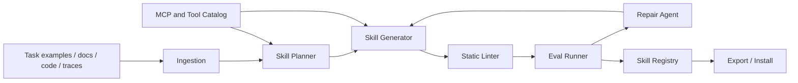

# Architecture

Agent Skill Factory is designed as a small set of composable services. The architecture should stay simple enough for local CLI use while leaving a path to a hosted web app.

## System Flow



## Modules

### 1. Ingestion

The deterministic ingestion layer normalizes untrusted local material into a versioned,
reviewable `SkillPlan`:

- Recursively indexes supported UTF-8 text and code files with explicit size limits.
- Extracts task examples, constraints, terminology, and compact summaries.
- Validates successful and failed Agent runs against the version 1 Trace contract.
- Aggregates observed tools and failure cases without treating them as authorization.
- Records relative source paths, sizes, kinds, and SHA-256 digests.
- Omits known dangerous or prompt-injection lines and emits review notes.

The CLI separates ingestion from writes:

```text
skill-factory ingest -> review SkillPlan JSON -> skill-factory generate --from-plan
```

This keeps heuristic extraction reviewable and allows offline CI fixtures. See
[Source and Trace Ingestion](ingestion.md).

### 2. Skill Planner

Classifies the Skill before generation:

- Knowledge Skill: domain rules, policies, vocabulary, style guides.
- Workflow Skill: multi-step procedures and decision points.
- Tool Skill: instructions for using APIs, MCP tools, or scripts.
- Asset Skill: reusable templates and static resources.
- Hybrid Skill: `SKILL.md` plus references, scripts, and assets.

The planner decides the target resources and how much freedom the Agent should have:

- High freedom: heuristic guidance for flexible work.
- Medium freedom: preferred patterns and pseudocode.
- Low freedom: exact scripts or command sequences for fragile operations.

The current implementation has three planning modes:

- Deterministic CLI planning: user-provided `--name`, `--description`, `--brief`, `--resources`, and `--example` are converted into a `SkillPlan`.
- LLM planning: local Ollama or an OpenAI-compatible API returns a structured JSON `SkillPlan`, then the deterministic generator writes the files.
- Source planning: `ingest` converts documents, code, and traces into a versioned plan; `generate --from-plan` consumes the reviewed plan.

LLM planning deliberately produces data, not files. This keeps file writes reviewable and makes lint/eval gates easier to enforce.

### 3. Skill Generator

Creates the Skill package:

- `SKILL.md`
- optional `references/`
- optional `scripts/`
- optional `assets/`
- optional `agents/openai.yaml`

Generation rules:

- Put triggering information in the frontmatter description.
- Keep `SKILL.md` concise.
- Move long domain content into `references/`.
- Write source provenance and compact trace observations to `references/sources.md`.
- Add scripts when deterministic reliability matters.
- Do not add auxiliary docs inside the generated Skill package.

### 4. Static Linter

Checks basic correctness before any Agent run:

- Folder name matches Skill name.
- Name uses lowercase letters, digits, and hyphens.
- Description explains both capability and trigger context.
- `SKILL.md` stays below configured line/token limits.
- Referenced files exist.
- Scripts declare dependencies and fail clearly.
- Instructions are not generic filler.
- Dangerous permissions are flagged.

### 5. Eval Runner

Runs isolated comparisons:

- Trigger eval: should-trigger vs should-not-trigger prompts.
- Output eval: realistic task cases with expected outcomes.
- Runner eval: with-skill vs without-skill execution through a runner abstraction.
- Baseline eval: old-skill vs new-skill regression comparison.
- Cost eval: token count, runtime, and tool-call count.
- Safety eval: attempts to trigger unsafe actions or data exposure.

The current implementation includes:

- Local trigger evals.
- Package text assertions.
- `runner_tests` with assertion score deltas.
- A deterministic dry-run runner for CI.
- An optional LLM runner backed by Ollama or an OpenAI-compatible API.
- Markdown and JSON reports.
- Baseline Skill comparison for regression gates.

Real Agent runtime adapters, trace capture, cost metrics, and model-graded evals remain future work.

### 6. Repair Agent

Turns lint and eval failures into bounded edits:

- Change the description.
- Remove redundant instructions.
- Add a missing edge case.
- Split long content into references.
- Add or harden a script.
- Narrow permissions.

The repair loop should reject edits that do not improve held-out eval scores.

The current implementation includes:

- `repair plan` for reviewable JSON repair plans.
- `repair apply` for deterministic file edits.
- Description repair for missing or weak trigger metadata.
- Missing resource creation.
- Oversized `SKILL.md` body splitting into `references/overflow.md`.
- Positive eval assertion repair notes.
- Lint/eval reruns after repair.
- Rollback when lint or eval quality regresses.
- Manual review blocks for security-related findings.

LLM-assisted repair proposals and real Agent runtime scoring remain future work.

### 7. Skill Registry

Stores generated Skills and metadata:

```json
{
  "name": "example-skill",
  "version": "0.1.0",
  "status": "draft",
  "risk_level": "low",
  "eval_score": 0.0,
  "source_hashes": [],
  "export_targets": ["agents", "claude", "codex"]
}
```

The current local implementation stores this metadata in `.skill-factory/registry.json`.
It records:

- frontmatter name and description
- local package path
- user-supplied version
- lint-derived risk summary
- eval status when `evals/evals.json` exists
- deterministic package and file SHA-256 hashes

The registry stores metadata only. The source Skill directory remains the source of truth.

### 8. Export / Install

The current implementation can copy a Skill package into client-oriented skill directories:

| Target | Default destination |
|---|---|
| `agent-skills` | `.agents/skills/` |
| `codex` | `.codex/skills/` |
| `claude-code` | `.claude/skills/` |

`export` copies a direct Skill path. `install` resolves a registered Skill name and then exports it.

Future work should add signed packages, dependency metadata, and trust-policy checks before hosted registry support.

## Deployment Shape

Phase 1 should be a local CLI. Later phases can add:

- Web UI for uploading source material and reviewing generated Skills.
- Hosted registry with signed Skill packages.
- MCP integration for tool discovery.
- Multi-agent eval execution.
